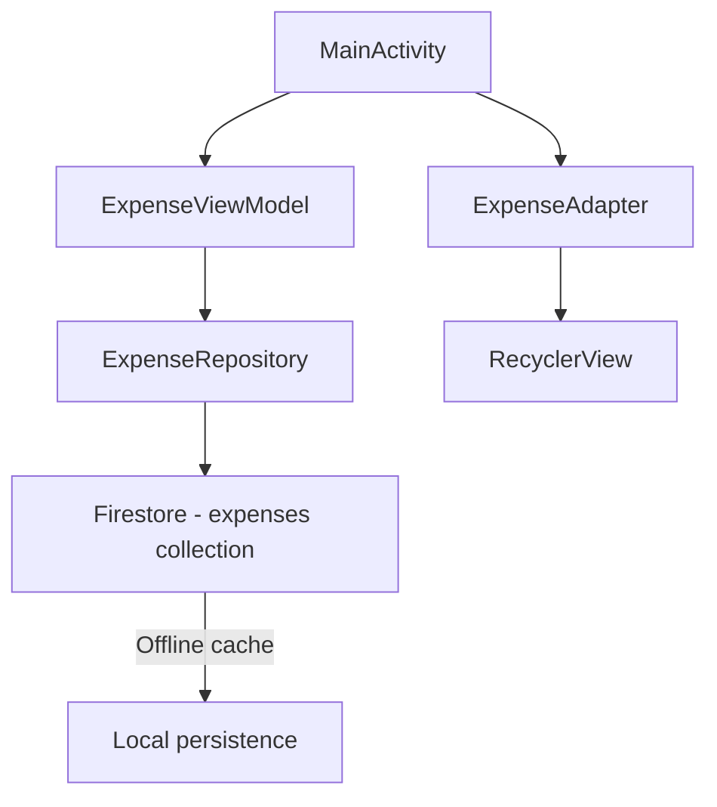

# 🎨 Walkthrough: First Design
> [ [Main README](./README.md) ] &nbsp; | &nbsp; [ **Walkthrough** ] &nbsp; | &nbsp; [ [Implementation Plan](./implementation_plan_fairshare.md) ]
---

# FairShare Expense Tracker — Walkthrough

## Summary
Built a complete **offline-first Expense Tracker** Android app with Firestore sync using Java, Material Design, and MVVM architecture.

## Architecture

## Files Created / Modified

### Build Configuration
| File | Action |
|------|--------|
| [libs.versions.toml](file:///c:/Users/Melben/AndroidStudioProjects/FairShare/gradle/libs.versions.toml) | Added Firebase BOM, Firestore, Lifecycle deps |
| [build.gradle.kts (root)](file:///c:/Users/Melben/AndroidStudioProjects/FairShare/build.gradle.kts) | Added google-services plugin |
| [build.gradle.kts (app)](file:///c:/Users/Melben/AndroidStudioProjects/FairShare/app/build.gradle.kts) | Added all deps, enabled ViewBinding |
| [gradle.properties](file:///c:/Users/Melben/AndroidStudioProjects/FairShare/gradle.properties) | Added `android.useAndroidX=true` |
| [google-services.json](file:///c:/Users/Melben/AndroidStudioProjects/FairShare/app/google-services.json) | **Placeholder** — replace with real Firebase config |

### Data Layer
| File | Purpose |
|------|---------|
| [Transaction.java](file:///c:/Users/Melben/AndroidStudioProjects/FairShare/app/src/main/java/com/example/fairshare/Transaction.java) | POJO model with Firestore annotations |
| [ExpenseRepository.java](file:///c:/Users/Melben/AndroidStudioProjects/FairShare/app/src/main/java/com/example/fairshare/ExpenseRepository.java) | Firestore CRUD + real-time snapshot listener |

### Business Logic
| File | Purpose |
|------|---------|
| [ExpenseViewModel.java](file:///c:/Users/Melben/AndroidStudioProjects/FairShare/app/src/main/java/com/example/fairshare/ExpenseViewModel.java) | Exposes LiveData, delegates to repository |
| [FairShareApp.java](file:///c:/Users/Melben/AndroidStudioProjects/FairShare/app/src/main/java/com/example/fairshare/FairShareApp.java) | Application class, enables Firestore offline cache |

### UI Layer
| File | Purpose |
|------|---------|
| [MainActivity.java](file:///c:/Users/Melben/AndroidStudioProjects/FairShare/app/src/main/java/com/example/fairshare/MainActivity.java) | Wires everything: RecyclerView, dialog, balance summary |
| [ExpenseAdapter.java](file:///c:/Users/Melben/AndroidStudioProjects/FairShare/app/src/main/java/com/example/fairshare/ExpenseAdapter.java) | ListAdapter with DiffUtil, color-coded categories |
| [activity_main.xml](file:///c:/Users/Melben/AndroidStudioProjects/FairShare/app/src/main/res/layout/activity_main.xml) | Balance card + RecyclerView + FAB |
| [item_expense.xml](file:///c:/Users/Melben/AndroidStudioProjects/FairShare/app/src/main/res/layout/item_expense.xml) | Transaction card with category indicator |
| [dialog_add_expense.xml](file:///c:/Users/Melben/AndroidStudioProjects/FairShare/app/src/main/res/layout/dialog_add_expense.xml) | Add transaction form dialog |

### Resources
| File | Purpose |
|------|---------|
| [colors.xml](file:///c:/Users/Melben/AndroidStudioProjects/FairShare/app/src/main/res/values/colors.xml) | Dark theme palette with category colors |
| [strings.xml](file:///c:/Users/Melben/AndroidStudioProjects/FairShare/app/src/main/res/values/strings.xml) | All UI strings + categories array |
| [themes.xml](file:///c:/Users/Melben/AndroidStudioProjects/FairShare/app/src/main/res/values/themes.xml) | Material NoActionBar dark theme |

## Verification
- ✅ `./gradlew assembleDebug` — **BUILD SUCCESSFUL** (35 tasks)

## Next Steps
> [!IMPORTANT]
> Replace [app/google-services.json](file:///c:/Users/Melben/AndroidStudioProjects/FairShare/app/google-services.json) with your real Firebase project config to enable cloud syncing. Until then, the app will work offline via Firestore's local persistence cache.
